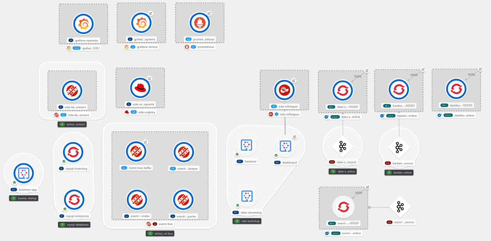

# Event-Driven Architecture Workshop

In the digital transformation strategies of companies, Serverless technologies, Event-Driven Architectures (EDA)
and data capture patterns (Change Data Capture) are gaining more strength every day.
 
Within this scenario, [Red Hat OpenShift Serverless](https://www.openshift.com/learn/topics/serverless),
[Red Hat AMQ Streams](https://www.redhat.com/en/technologies/jboss-middleware/amq),
[Red Hat Integration](https://www.redhat.com/en/products/integration),
[Red Hat Data Grid](https://www.redhat.com/en/technologies/jboss-middleware/data-grid),
and [Red Hat build of Quarkus](https://access.redhat.com/products/quarkus), offer companies
significant cost savings and multiple operational benefits by shifting infrastructure and
provisioning responsibilities to the different frameworks. This enables you
to solve problems quickly, at scale, and with high availability.

This repository includes a practical business example so that we can adopt modern and agile application
designs and implementations (containers, Serverless, streaming, etc.).

The logical architecture diagram of this use case is:


At the end of the instructions you will have deployed a full Event-Driven Architecture with the
following deployment topology:



This file include the list of steps to deploy easily this use case for your learning and testing efforts
about these amazing technologies and products.

## Prepare OpenShift

This architecture has been tested in Red Hat OpenShift Container Platform 4.7 version.

As a normal user in your OpenShift cluster, create a ```eda-workshop``` namespace:

```shell
❯ oc login -u user
❯ oc new-project eda-workshop
```

## Deploy Operators

Follow [the instructions](./01-operators/README.md)

## Deploy Metrics Platform

Follow [the instructions](./02-metrics/README.md)

## Deploy Databases

Follow [the instructions](./03-databases/README.md)

## Deploy Streaming Platform

Follow [the instructions](./04-kafka/README.md)

## Deploy Service Registry

Follow [the instructions](./05-service-registry/README.md)

## Deploy KafkaConnect

Follow [the instructions](./06-kafka-connect/README.md)

## Deploy DataGrid

Follow [the instructions](./07-datagrid/README.md)

## Deploy Quarkus Business Application

Follow [the instructions](./08-quarkus-business-app/README.md)

## Publish Schemas API

Follow [the instructions](./09-event-schemas-api/README.md)

## Deploy Quarkus Streaming Application

Follow [the instructions](./10-quarkus-streaming/README.md)

## Deploy Quarkus Backend Application

Follow [the instructions](./11-quarkus-backend/README.md)

## Deploy Quarkus Dashboard Application

Follow [the instructions](./12-quarkus-dashboard/README.md)

## Deploy Serverless Services

Follow [the instructions](./14-serverless/README.md)

## Deploy Native Serverless Services

Follow [the instructions](./15-native-services/README.md)
